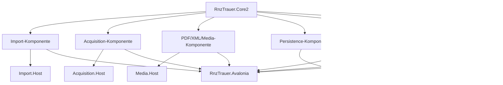

# RNZ Traueranzeigen — komponentenorientierter Umsetzungsplan

**Stand:** 2026-08-06  
**Leitentscheidung:** Fachliche Komponenten werden unabhängig mit eigenen Tests und lauffähigen Hosts entwickelt. Die Gesamtanwendung wird erst in einer abschließenden Integrationsphase zusammengesetzt.

## Zielarchitektur

## Entwicklungsregeln

- Jede Komponente besteht aus Produktionsprojekt, dediziertem MSTest-Projekt und einem kleinen unabhängigen Host.
- Komponenten kommunizieren ausschließlich über fachliche Interfaces und immutable DTOs.
- Kein Host darf Avalonia benötigen, außer dem späteren UI-Host.
- Provider-spezifischer Code bleibt im Provider-Projekt.
- Jeder Host muss mit lokalen Fixtures oder Testdaten ohne Produktionssystem ausführbar sein.
- Erst nach abgeschlossener Einzelabnahme werden Komponenten in `RnzTrauer.Avalonia` registriert.

## Phase 0 — Verträge und Testinfrastruktur

**Status:** Teilweise abgeschlossen

1. Gemeinsame Core-Verträge für Importergebnisse und Diagnosemeldungen prüfen und stabilisieren.
2. Ein einheitliches Ergebnis-/Fehlermodell mit Warnungen, Fehlern, Zählungen und Cancellation definieren.
3. Fixture-Verzeichnis und Testdatenkonventionen für HTML, Schema, PDF/XML, Datenbank und Export festlegen.
4. Für jeden Host ein minimales `--help`, `--input`, `--output` und strukturiertes Logformat vorsehen.
5. Pascal-Verhalten im Delphi-Wiki dokumentieren, bevor es zu einem C#-Vertrag wird.

**Erreicht:** Der Import verfügt über einen eigenen öffentlichen Vertrag, einen JSON-fähigen Ergebnisbericht und einen unabhängigen Host mit `--help`, `--html`, `--schema` und `--output`.

**Offen:** Diagnosemodell, gemeinsame Request-/Result-Konvention und standardisiertes Logging für alle künftigen Komponenten.

**Abnahme:** Alle Verträge sind ohne Avalonia referenzierbar; jeder neue Host startet mit `--help`; Core-Tests bleiben grün.

## Phase 1 — HTML-/Schema-Import-Komponente

**Produktionsprojekt:** `RnzTrauer.Import`  
**Testprojekt:** `RnzTrauer.Import.Tests`  
**Host:** `RnzTrauer.Import.Host`

1. Vieser-Golden-Fixtures über I12 hinaus portieren.
2. Vollständige Schemazeilen, Callback-Tokens, `+`, `[`, `j`, `J`, `A`, `D` und `N` charakterisieren.
3. CP1252-, UTF-8-, BOM- und beschädigte Eingaben testen.
4. Deterministischen Importbericht mit abgeschlossenen/teilweisen Zeilen, nächsten Dateien und Parserdiagnosen erzeugen.
5. Host verarbeitet lokale HTML-/Schema-Dateien und schreibt JSON als überprüfbares Ergebnis.

**Abnahme:** Import funktioniert vollständig offline; Abweichungen zur Pascal-Referenz sind dokumentiert; keine Persistenz- oder UI-Abhängigkeit.

## Phase 2 — Acquisition-Komponente

**Produktionsprojekt:** `RnzTrauer.Acquisition`  
**Testprojekt:** `RnzTrauer.Acquisition.Tests`  
**Host:** `RnzTrauer.Acquisition.Host`

1. HTTP- und lokale Quellen hinter `IHtmlAcquisitionService` kapseln.
2. Timeout, Cancellation, Größenlimit, Retry-Regeln und Fortschritt definieren.
3. Relative PDF-/PNG-URLs auflösen.
4. Temporäre Dateien atomar ins Archiv übernehmen.
5. Host mit Mock-HTTP-Handler und lokalem Fixture-Server betreiben.

**Abnahme:** Netzwerkfehler, Abbruch und Teil-Dateien sind reproduzierbar testbar; keine direkte Portalabhängigkeit im Core.

## Phase 3 — PDF/XML-/Medien-Komponente

**Produktionsprojekt:** `RnzTrauer.Media`  
**Testprojekt:** `RnzTrauer.Media.Tests`  
**Host:** `RnzTrauer.Media.Host`

1. Prozessadapter für `pdftoxml`/`pdftotext` mit Whitelist, Timeout, Exit-Code- und Größenprüfung bauen.
2. XML-Textzeilen und Bildkandidaten extrahieren.
3. Bekannte PDF/XML-Fixtures als Golden-Tests verwenden.
4. OCR als austauschbare Strategie vorsehen.
5. PDF-XChange-Fenster-/Clipboard-Automation nicht übernehmen.

**Abnahme:** Host erzeugt aus einem lokalen PDF reproduzierbar Text- und Bildkandidaten oder einen diagnostizierten Fehler.

## Phase 4 — Persistence-Komponente

**Produktionsprojekt:** `RnzTrauer.Persistence.MySql`  
**Testprojekt:** `RnzTrauer.Persistence.MySql.Tests`  
**Host:** `RnzTrauer.Persistence.Host`

1. Import/Upsert, Save, Link-Kandidaten, Orte, Profilbilder und Review-Queues separat charakterisieren.
2. MySQL-Views dokumentieren und kapseln oder durch getestete parameterisierte Statements ersetzen.
3. Transaktionsgrenzen und Fehlerzählung festlegen.
4. Host gegen Testdatenbank oder reproduzierbare SQL-Testdoubles ausführen.
5. Erst danach weitere Providerneutralität über `IDbStatementRenderer` entscheiden.

**Abnahme:** Kein Test benötigt Produktionsdaten; alle SQL-Werte sind parameterisiert; Save-Fehler werden nicht verschluckt.

## Phase 5 — Places-/Geocoding-Komponente

**Produktionsprojekt:** `RnzTrauer.Places`  
**Testprojekt:** `RnzTrauer.Places.Tests`  
**Host:** `RnzTrauer.Places.Host`

1. Ortsnormalisierung, Kurz-/Langnamen und Koordinaten modellieren.
2. GEDCOM-`REFN`-Import unabhängig von der UI verarbeiten.
3. GeoNames-/Map-HTTP über Interfaces mit Rate-Limit und Cache anbinden.
4. Offline-Fixtures für Treffer, Mehrdeutigkeit und Nichttreffer ergänzen.

**Abnahme:** Ortsdaten können offline importiert, normalisiert und als Diagnosebericht ausgegeben werden.

## Phase 6 — Export-Komponente

**Produktionsprojekt:** bestehendes `RnzTrauer.Core2` oder separates `RnzTrauer.Export` nach Größenprüfung  
**Testprojekt:** bestehende Exporttests beziehungsweise separates dediziertes Testprojekt  
**Host:** `RnzTrauer.Export.Host`

1. TSV/CSV und GEDCOM gegen die Pascal-Erwartungen vergleichen.
2. Dateiziele, Encoding, BOM, Zeilenenden und Überschreibschutz testen.
3. Host erzeugt Exporte ausschließlich aus Fixture-Daten.

**Abnahme:** Exporte sind reproduzierbar und ohne UI ausführbar.

## Phase 7 — UI-Widgets und Einzelhosts

**Projekt:** `RnzTrauer.Avalonia`

1. Für Filter, Grid, Detailbearbeitung, Medienauswahl, Orte und Einstellungen jeweils getrennte ViewModels/Widgets schneiden.
2. UI verwendet ausschließlich die stabilen Komponentenschnittstellen.
3. Keine Domänenlogik aus den Hosts in Code-behind verschieben.
4. Dialoge für Datei- und Verzeichnisauswahl sowie Secret-Provider integrieren.

**Abnahme:** Die UI kann jede Komponente einzeln über DI ersetzen und mit lokalen Fixture-Diensten starten.

## Phase 8 — Gesamtintegration und End-to-End-Host

**Host:** `RnzTrauer.Avalonia` beziehungsweise ein zusätzlicher `RnzTrauer.Integration.Host`

1. DI-Komposition der einzeln abgenommenen Komponenten.
2. Ablauf `Acquisition -> Import -> Media -> Parser -> Review -> Persistence -> Export`.
3. End-to-End-Fixture mit vollständig lokalem Datenbestand.
4. Abbruch, Wiederaufnahme, Teilfehler und Retry im Gesamtworkflow testen.
5. Erst danach produktive Portal-/Datenbankkonfiguration freigeben.

**Abnahme:** Der Offline-End-to-End-Lauf ist reproduzierbar; jeder Teilschritt liefert nachvollziehbare Ergebnisse; Produktionszugänge sind konfigurierbar und nicht fest im Code hinterlegt.

## Definition of Done

- Produktionsprojekt, Testprojekt und Host sind vorhanden.
- Pascal-Verhalten und bewusste Abweichungen sind im Delphi-Wiki dokumentiert.
- MSTest-/NSubstitute-Tests decken Normalfall, Fehlerfall und Cancellation ab.
- Host kann ohne Gesamtanwendung lokal ausgeführt werden.
- Build und kleinster relevanter Testlauf sind erfolgreich.
- `RnzTrauer.Info.md` wird nach jeder abgeschlossenen Phase aktualisiert.

## Bewusste Nicht-Ziele

- Keine direkte Portierung der Windows-Fensterautomation des PDF-XChange Viewers.
- Keine Ablehnung historisch unvollständiger Daten wegen Plausibilitätswarnungen.
- Keine produktive Gesamtintegration, solange die Einzelhosts ihre Abnahmekriterien nicht erfüllen.

## Erledigter nächster Schritt

**Places-/Geocoding-Komponente um einen Host-Policybericht erweitert.**  
Die erste Places-Komponente normalisiert Eingaben und klassifiziert bekannte,
unbekannte sowie leere Orte ohne externe HTTP-Aufrufe und ohne erfundene
Koordinaten. Alias-/Mehrdeutigkeitsverträge und das isolierte
`IGeocodingAdapter`, `OfflineGeocodingAdapter` sowie
`CachingGeocodingAdapter` mit Fake-Zeit- und Rate-Limit-Tests sind ergänzt. Als
der Host jetzt einen diagnostischen Policybericht für Cache-Hits, Misses,
Remote-Requests und Rate-Limit-Ablehnungen ausgibt. Ein externer Provider
bleibt bis zu einer späteren Entscheidung ausgeschlossen. Die
Avalonia-Anwendung bleibt bis zur späteren Integrationsphase unverändert.

## Unmittelbarer nächster Task

Eine konfigurierte RNZ-Datenbank für den Live-Probe bereitstellen und den
Status `Available` oder das reale Fehlercode-Verhalten des eingesetzten
MySQL-Providers bestätigen. Der Probe liefert jetzt zusätzlich stabile Codes:
`schema.available`, `schema.missing_columns`, `schema.unverified` und
`schema.probe_failed`. Ohne Verbindung bleibt der Status `Unverified`.
Bei fehlenden `Orte.Latitude`/`Orte.Longitude` muss Persistence deaktiviert
oder über eine explizite Migration erweitert werden. Ein realer
Geocoding-Provider bleibt bis zur fachlichen Freigabe ausgeschlossen.

## Neuer Integrationsstand

Die Avalonia-Kompositionswurzel referenziert jetzt `RnzTrauer.Places` und
registriert den MySQL-Koordinatenspeicher unter
`IPlaceCoordinateStore` und `ICoordinateSchemaProbe`. Als nächstes benötigt die
UI ein eigenes ViewModel für den Schema-/Ortsstatus; die Datenbankprüfung darf
dabei nicht synchron im UI-Start ausgeführt werden. Ein externer
Geocoding-Provider wird erst nach einer fachlichen Anbieter- und
Datenschutzentscheidung registriert.

Das `MainWindowViewModel` startet den Koordinaten-Schema-Probe jetzt
asynchron. Der Orte-Tab zeigt Status, stabilen Diagnosecode und Diagnose an
und bietet eine manuelle Wiederholung. Der nächste UI-Schritt ist die
fachliche Ortsauswahl bzw. Koordinatenbearbeitung; Schreibvorgänge bleiben
bis zum Status `Available` gesperrt.

Die erste provider-neutrale Koordinatenbearbeitung ist jetzt vorhanden:
Ortsname, Latitude, Longitude, Quelle und Approximation können geladen und
bearbeitet werden. Speichern bleibt bis zur bestätigten Schema-Verfügbarkeit
deaktiviert. Als nächstes sollte die Ortsauswahl mit dem ausgewählten
Todesanzeigen-Datensatz verbunden und durch eigene ViewModel-Tests abgesichert
werden.

Der Ortswert des ausgewählten Datensatzes ist jetzt direkt mit dem
Koordinateneditor verbunden; beim Datensatzwechsel werden alte Koordinaten
verworfen. Als nächstes folgen dedizierte ViewModel-Tests für Auswahlbindung,
Schema-Gating, Validierung, Laden und Speichern.

Das dedizierte Projekt `RnzTrauer.Avalonia.Tests` ist jetzt vorhanden und
deckt diese vier Kernfälle ab. Der nächste fachliche Schritt ist die
Entscheidung zur Behandlung fehlender Koordinatenspalten (Migration versus
deaktivierte Persistenz), bevor produktive Schreibpfade freigegeben werden.

Ein sicherer, nicht automatisch ausgeführter Migrationsentwurf ist jetzt über
`RnzTrauer.Persistence.Host --coordinate-migration` verfügbar. Er gibt das
`ALTER TABLE` für `Orte.Latitude` und `Orte.Longitude` nur zur Prüfung aus.
Die fachliche Freigabe und Ausführung bleibt ein separater Deployment-Schritt.

Die ViewModel-Testabdeckung enthält jetzt auch den erfolgreichen Save-Pfad bei
`Available`; damit sind Auswahlbindung, Schema-Gating, Validierung, Laden und
Speichern abgedeckt.

Der vollständige Regressionlauf über `RnzTrauer.slnx` ist ebenfalls grün. Die
Komponentensuite umfasst nun 100 bestandene Tests. Der nächste fachliche
Blocker bleibt die Deployment-Entscheidung für fehlende Koordinatenspalten.

## Betriebsentscheidung 2026-08-11

Fehlende `Orte.Latitude`/`Orte.Longitude` deaktivieren die
Koordinatenpersistenz standardmäßig. Die Anwendung führt keine
Schemaänderung automatisch aus. Eine freigegebene Migration muss außerhalb
der Anwendung ausgeführt werden; erst ein anschließender Probe-Status
`Available` aktiviert Schreibvorgänge.

Da das aktuelle Schema nur Latitude und Longitude speichert, weist die UI
beim Speichern zusätzlich mit `coordinate.saved_partial_metadata` darauf hin,
dass Quelle und Approximation noch nicht persistiert werden. Eine spätere
Schemaerweiterung muss diese Metadaten ausdrücklich charakterisieren.
Beide Felder sind im Orte-Tab zusätzlich als `session only` gekennzeichnet.
Der Auswahlbindungstest schützt außerdem gegen das Übertragen alter
Koordinaten auf einen neu ausgewählten Datensatz.

Für den späteren Live-Probe können Server, Port, Benutzer und Datenbank jetzt
über `--server`, `--port`, `--user` und `--database` überschrieben werden.
Das Passwort bleibt ausschließlich in `RNZ_DB_PASSWORD`.
Ungültige explizite Portwerte werden mit Exit-Code 2 abgewiesen und nicht
mehr auf 3306 zurückgesetzt.

Parallel zur blockierten Live-Datenbankprüfung ist der Export jetzt über
`RnzTrauer.Export.Host` offline ausführbar. Der Host verarbeitet
JSON-Fixtures mit `--format tsv|gedcom`; als nächstes sollten Dateiziele,
Überschreibschutz und weitere Pascal-Golden-Fixtures charakterisiert werden.
Der Überschreibschutz ist jetzt umgesetzt: ohne `--overwrite` endet ein
bestehendes Ziel mit Exit-Code 2.
Eine Edge-Fixture prüft zusätzlich Kategorienfilter und die Bereinigung von
Tabulatoren/Zeilenumbrüchen; weitere Pascal-Golden-Fixtures bleiben offen.
Beschädigte oder fehlende Eingabe-JSON-Dateien werden nun ebenfalls mit
Exit-Code 2 und einer knappen Diagnose abgewiesen.
