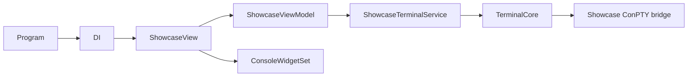

# ConsoleLib Showcase – Native gallery

## Status

Done

## Goal

Deliver a native `ConsoleLib`/`ConsoleLib.ExtCon` showcase under
`ConsoleApps` that demonstrates the current controls, layout contracts, visual
effects, MVVM/DI composition, and the showcase-owned Windows terminal bridge.

## Delivered

- `ConsoleLib.Showcase` native executable with a component gallery.
- `ShowcaseViewModel` using CommunityToolkit.Mvvm commands and observable state.
- Microsoft.Extensions.DependencyInjection composition root.
- Menu/help dialog, selected-area inspector, status line, and resize handling.
- Animated glyph-wave effect and determinate progress demonstration.
- `ConsoleLib.Showcase.Terminal.Core` containing the Windows-only ConPTY bridge.
- Snapshot rendering, key input routing, SGR mouse negotiation, resize, and
  session lifecycle integration for the bridge.
- `ConsoleLib.Showcase.Tests` with MSTest coverage for effects, commands, and
  bridge platform contracts.

## Architecture

Reusable `Libraries/Terminal.Core` remains platform-neutral. The ConPTY
implementation is deliberately owned by the showcase project so the demo does
not introduce a Windows provider into the reusable terminal contracts.



## Validation

```text
dotnet build ConsoleApps\ConsoleLib.Showcase\ConsoleLib.Showcase.csproj -f net8.0-windows
dotnet test ConsoleApps\ConsoleLib.Showcase.Tests\ConsoleLib.Showcase.Tests.csproj -f net8.0-windows
```

Latest run: the showcase build completed with 0 warnings and 0 errors. The
dedicated suite passed 9 tests; the Windows-only negative-path test was
inconclusive on the Windows build host. Existing regression suites also
passed: `Terminal.Core.Tests` (29) and `ConsoleLib.ExtConTests` (18).
