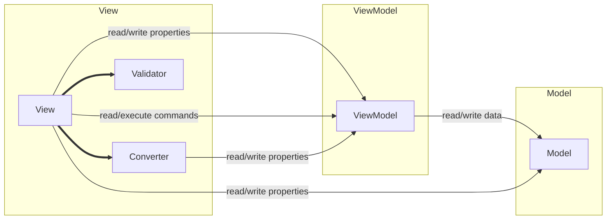
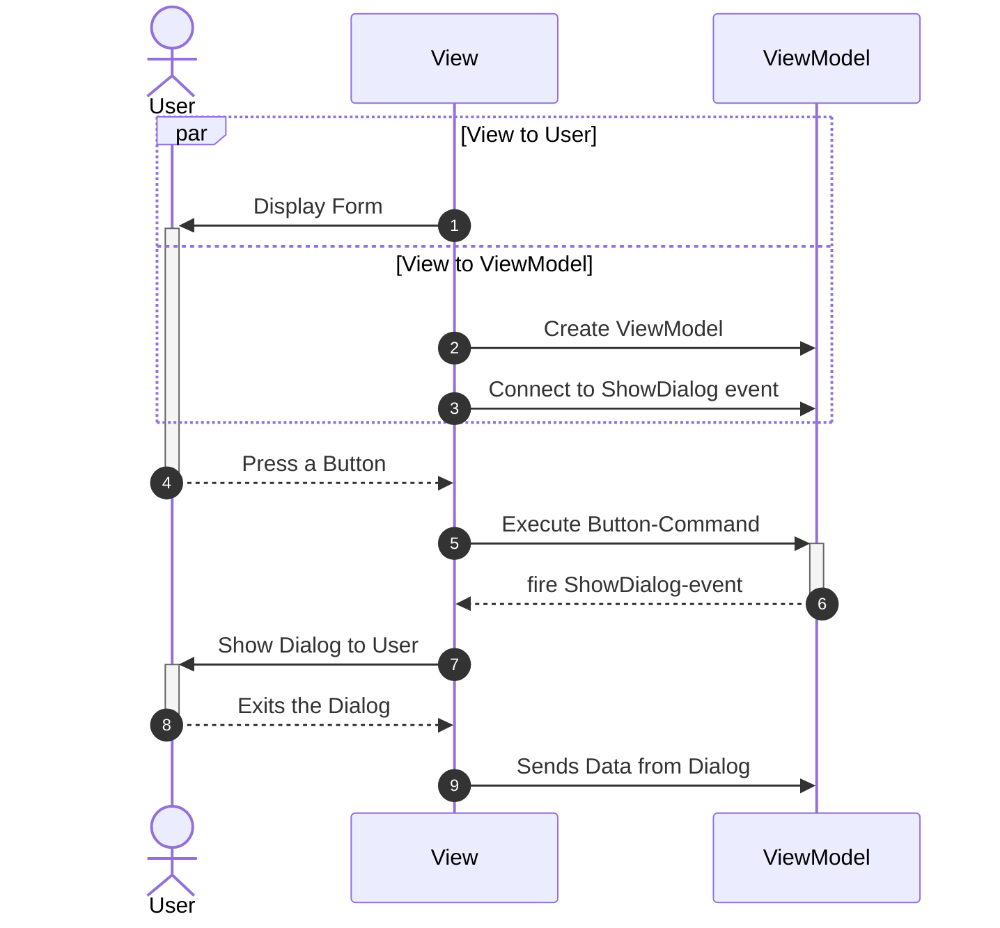

# MVVM Tutorials

## Lession 3: The MVVM - Model

## Lession 6: Converters
Part 1 - simple Converter 
 
Part 2 - Converter incl. convert back 
 
Part 3 - Converter incl. format parameter 
 

## Lession 09: DialogBoxes

## Lession 16: UserControls
A first glance

## Lession 20: Sysdialogs 
How to open and use (System)-common dialogs

## Lession 21: Buttons 
Use Converter to change the color, and the BaseViewModel.CommandCanExecureBinding to update the Properties.  
It's a game: goal to set all buttons to green. 
 
    
## Lession 22: WpfCap 
Use Converter to change the color, and the BaseViewModel.CommandCanExecureBinding to update the Properties. 
It's a game: goal to sort all colors of the tiles. 
 

## Lession 24: UserControls extended
Some extended user-controls.

## Lession 27&28: Datagrid
Use a Datagrid to diaplay data
* First: a simple form with a Datagrid
* Second: a datagrid with more complex data
* Third: a custom popup-menu to delete data

## Lession 31: Validation of values
Part 1 - via Exception 

 
Part 2 ...

## Lession 33: Events to commands
Use Xaml.Behaviours to use events as commands.
e.g: "got focus" & "lost focus"

## Lession 34: Binding-event Args

## Lession 35: The "CommunityToolkit"
A first use-case

## Lession 36: The "CommunityToolkit" saves work.
An example with a login-Command, a login-Dialog, a "dummy"-userservice.
Showcase of WeakReferenceMessenger and how it makes the life easy.

## Lession 37: Treeview
A book-database with books grouped by category.
Also a showcase for a master-detail-form.

## Lession 38: Dependency injection
small showcase for DI.

## Lession 39: A multi-model-app
An demo-app having 2 models.
showcase for scoped dependency-injection.

## Lession 40: Wizzard
A demo-wizzard app.
With succesive asking the user for information.