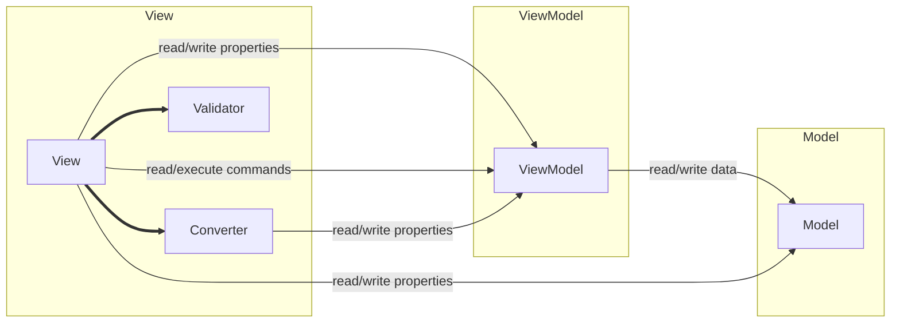

# MVVM Tutorials

## Lession 3: The MVVM - Model

## Lession 6: Converters
Part 1 - simple Converter 
 
Part 2 - Converter incl. convert back 
 
Part 3 - Converter incl. format parameter 
 

## Lession 20: Sysdialogs 
How to open and use (System)-common dialogs

## Lession 21: Buttons 
Use Converter to change the color, and the BaseViewModel.CommandCanExecureBinding to update the Properties.  
It's a game: goal to set all buttons to green. 
 
    
## Lession 22: WpfCap 
Use Converter to change the color, and the BaseViewModel.CommandCanExecureBinding to update the Properties. 
It's a game: goal to sort all colors of the tiles. 
 

## Lession 31: Validation of values
Part 1 - via Exception 

 
Part 2 ...
